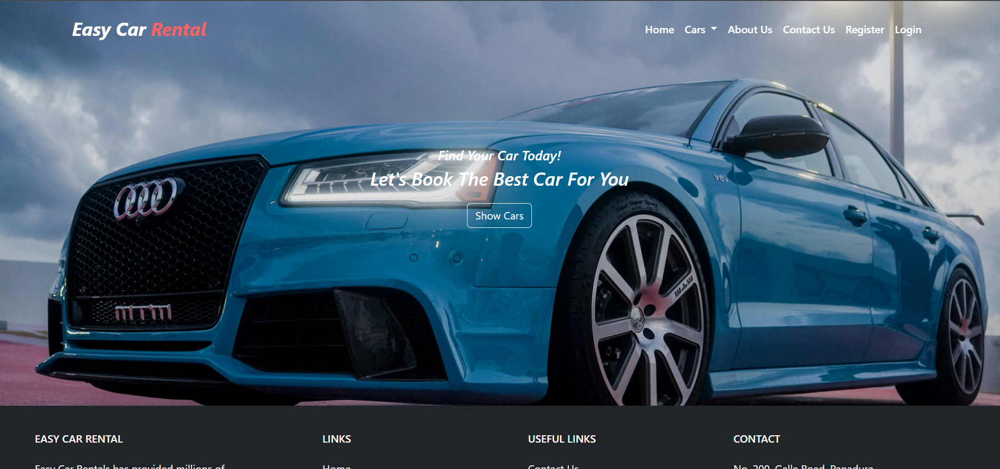

# CAR RENTAL - SPRING MVC

### Description

A web application designed for a car rental place to handle its all rental processes.
Customers can rent cars using this application & it allows the admin to manage
the daily tasks more conveniently and effectively with rental details.

### Purpose ?

This app is built to improve knowledge of APIs and learn how to use Spring framework. 

## Built With
#### Languages

• Java  
• HTML  
• CSS  
• JavaScript  

#### Frameworks & Libraries

• Spring MVC  
• Bootstrap  
• Hibernate  
• jQuery  
• MySQL Connector  

#### Architectures

• Layered Architecture  
• Service-oriented architecture (SOA)  

#### Others

• Maven  
• AJAX  
<!-- • DBCP (Database Connection Pooling)   -->

